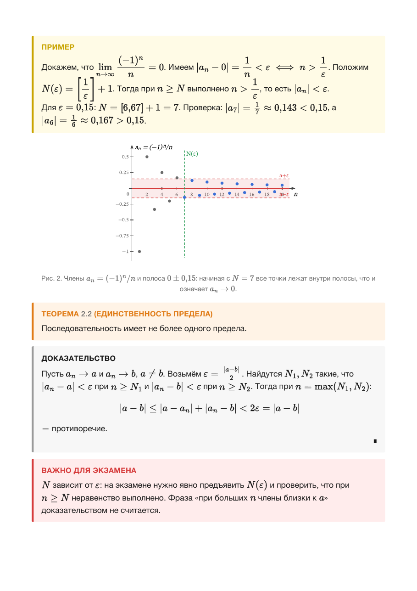
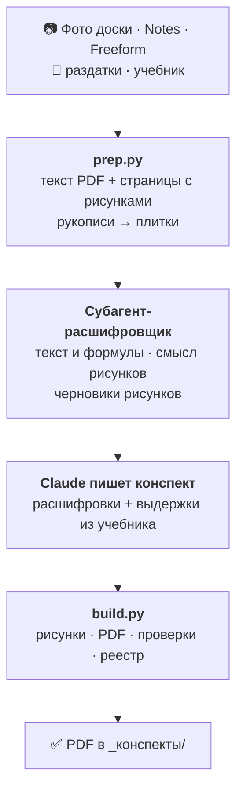
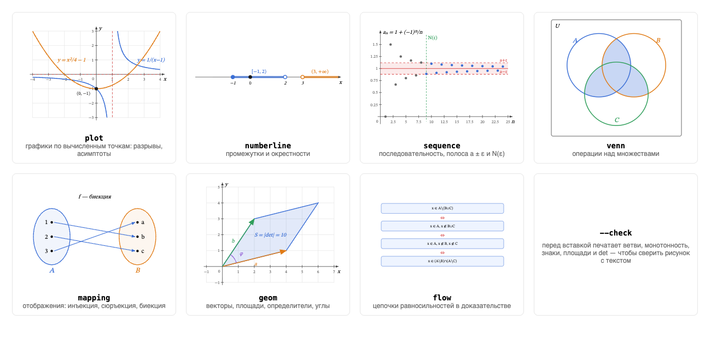

# ClaudeStudy

**Конспекты по математике силами Claude Code: из фото лекций, раздаток и учебника — строгий PDF с теоремами,
доказательствами, разобранными примерами и точными рисунками. Одной командой.**



Демо: [`examples/пример_конспекта.pdf`](examples/пример_конспекта.pdf) — предел последовательности, рисунки из
`figures.py`, блоки «Разбор» и «Важно для экзамена».

**Содержание:** [Зачем](#зачем) · [Как это работает](#как-это-работает) · [Возможности](#возможности) ·
[Команды](#команды) · [Установка](#установка) · [Устройство проекта](#устройство-проекта) ·
[Расход токенов](#расход-токенов) · [Настройка](#настройка) · [Честное использование](#честное-использование)

---

## Зачем

Материал одной темы обычно разбросан по нескольким местам: записи с лекции, раздатка преподавателя, учебник,
запись аудио. Собрать из этого конспект долго. А попросить чат-бота «объясни тему» — значит получить пересказ
с «улучшенными» формулировками, выдуманными доказательствами и графиками «на глаз».

ClaudeStudy превращает Claude Code в **конспектора с жёсткими правилами**:

- **по твоим материалам, а не «по мотивам»** — формулировки как в источнике, нет доказательства — так и написано;
- **с сохранением смысла доски** — цвета, стрелки, схемы и чертежи лекции переносятся в конспект, а не теряются;
- **с разбором того, что непонятно именно тебе** — маркер `[?]` в записях превращается в объяснение с примером;
- **с подготовкой к экзамену** — карточки, задачи с решениями, шпаргалки;
- **экономно** — каждый исходник «читается глазами» один раз, дальше работа идёт с текстом.

| | Обычный чат | ClaudeStudy |
|---|---|---|
| Источник | общие знания модели | **твои** лекции, раздатки, учебник; приоритет: лекция = преподаватель > учебник > аудио |
| Формулировки | пересказ | дословно как в источнике; расхождения источников и описки на доске отмечены явно |
| Доказательства | бывают выдуманы | из материалов или стандартное с пометкой источника; иначе — «не приведено» |
| Рисунки | от руки, «на глаз» | вычислены по точкам и проверены; рисунки доски и учебника переносятся со смыслом |
| Непонятные места | надо формулировать вопрос заново | маркер прямо в записях → блок «Разбор» на своём месте |
| Результат | текст в чате | PDF в едином стиле: определение / теорема / доказательство / пример |
| Память | каждый раз заново | реестр: что уже обработано и в какой PDF вошло |

## Как это работает



1. **Подготовка (`prep.py`).** Текстовые PDF превращаются в текст бесплатно: постранично, без колонтитулов,
   битая кодировка чинится. Страницы с рисунками сохраняются картинками, в тексте остаётся метка. Рукописи
   режутся на плитки без потери мелкого почерка.
2. **Расшифровка (субагент).** Отдельный помощник один раз читает плитки и пишет текст с формулами в LaTeX.
   К каждому рисунку он записывает, **что тот объясняет** (например, «зелёные треугольники — площадь со знаком +»),
   и набрасывает спецификацию для `figures.py`. Картинки не попадают в основной диалог.
3. **Конспект (Claude).** Рукописные расшифровки читаются целиком, из учебника берутся нужные определения и
   теоремы одним вызовом `prep.py excerpt`. Каждый рисунок доски становится рисунком конспекта рядом со своим
   объяснением.
4. **Сборка (`build.py`).** Одна команда: подставляет и проверяет рисунки, печатает PDF, ловит сломанные
   формулы и потерянные рисунки, делает превью страниц с рисунками для финальной проверки, пишет реестр.

## Возможности

### 📄 Конспект одной командой
`/конспект матанализ` находит новые материалы, группирует их по темам и собирает PDF: определения → леммы и
теоремы → доказательства → примеры с числами. Формулы в LaTeX (MathJax), блоки раскрашены по типу, сверху легенда.
Имя файла — `лекция_2026-09-29_тема.pdf` по дате самого занятия.

### 🖍 Смысл доски сохраняется
На доске объясняют не только словами — цветом, стрелками, крестиками, штриховкой, порядком обхода. Расшифровка
записывает значение каждого такого элемента, а конспект обязан перенести **каждый** рисунок доски. `build.py`
предупредит, если рисунков в конспекте меньше, чем было на доске, а `/сверка` проверит, сохранился ли их смысл.
Описки на доске не исправляются молча — они выносятся в блок «Расхождение с доской».

### 📈 Точные рисунки: `figures.py`



Генератор SVG на чистом Python. Графики **никогда не рисуются от руки**: кривая строится по вычисленным значениям
и сама рвётся в точках разрыва. Перед вставкой `--check` печатает ветви, монотонность, знаки, площади и
определители — рисунок сверяется с текстом. Минимум один рисунок на каждый раздел; рисунки добавляются к тексту,
а не заменяют его.

### 📚 Учебник — точечно, но без потери рисунков
`prep.py excerpt` по терминам темы за один вызов достаёт из учебника целые блоки «определение/теорема +
доказательство»: одинаковые слайды склеены, сначала определения и теоремы. `pdftotext` выкидывает рисунки, поэтому
страницы учебника с рисунками сохранены картинками: если блок относится к теме, модель открывает ровно эту
страницу и переносит рисунок в конспект с подписью «по учебнику, стр. N».

### 🏷 Маркеры прямо в твоих записях

| Маркер | Что сделает Claude |
|---|---|
| `[?]` | объяснит проще, другими словами, с примером |
| `[??]` | объяснит с нуля, с предпосылками, минимум 2 примера |
| `[!]` | вынесет в блок «Важно для экзамена» и добавит в шпаргалку |
| `[пример]` | добавит разобранный пример с числами |
| `[док]` | даст полное доказательство (или честно напишет, что его нет в материалах) |
| `[почему]` | объяснит мотивацию: зачем понятие и где применяется |
| `[связь]` | покажет связь с другими темами предмета |

Маркеры работают в материалах, в записях с планшета и в `<предмет>/вопросы.md`.

### 🧠 Подготовка к экзамену
- **Карточки** для активного вспоминания: определения, формулировки теорем, формулы, «в чём ловушка».
- **Задачи** с полными решениями: 40% на определения и теоремы, 40% на вычисления, 20% на доказательства
  и контрпримеры, плюс типичные ошибки.
- **Шпаргалка** — двухколоночная выжимка на 1–2 страницы A4, всё с `[!]` — первым.
- **Разбор вопросов** — все маркеры из `вопросы.md` одним PDF.

### 🔍 Контроль качества
- `/сверка` сравнивает конспект с расшифровками: пропуски, расхождения формулировок, перенесены ли рисунки,
  а каждое неразборчивое место проверяет по своей плитке оригинала.
- `build.py` при каждой сборке ловит сырой LaTeX, символ `<` в формулах, неподставленные и потерянные рисунки.
- `/переделай` вносит точечную правку и пересобирает PDF с тем же именем.

### 🇬🇧 Английский — свой контур
Проверка **твоей** попытки домашки вместо готовых ответов, «ответ + правило» к каждому заданию, образцы письменных
работ на уровне студента, личный словарь с интервальным повторением и учёт повторяющихся ошибок, который
подмешивает слабые места в упражнения.

### 🔄 Синхронизация с iPad (macOS, по желанию)
Пишешь лекцию в Apple Notes или Freeform с меткой вроде `Матан-лекция 22.09.26`, а `/синхрон` выгружает её в PDF
в папку нужного предмета.

## Команды

| Команда | Что делает |
|---|---|
| `/конспект [предмет] [тема]` | собирает PDF-конспект по новым материалам |
| `/вопросы [предмет]` | отвечает на все маркеры из `вопросы.md` и материалов → PDF в `_разборы/` |
| `/объясни <что>` | быстрое объяснение в чате: суть, строгая формулировка, пример, типичная ошибка |
| `/карточки <предмет> [тема]` | карточки «вопрос–ответ» |
| `/задачи <предмет> <тема> [n]` | тренировочные задачи с решениями и типичными ошибками |
| `/шпаргалка <предмет> [тема]` | плотная выжимка к экзамену |
| `/сверка <предмет> <тема>` | ищет пропуски и расхождения с исходниками и исправляет их |
| `/переделай <предмет> <тема>: …` | точечная правка готового конспекта, включая рисунки |
| `/статус` | что обработано, что ждёт, сколько открытых вопросов |
| `/дз [тема]` | английский: проверка и разбор домашки (текст или фото) |
| `/слова [тема\|повтор]` | английский: словарь и упражнения на повтор |
| `/синхрон [--redo]` | macOS: выгрузка помеченных заметок из Notes и Freeform |

Конспект можно попросить и словами («сделай конспект по последней лекции») — навык `math-conspect-builder`
отправит к той же команде.

## Установка

**Нужно:**
- [Claude Code](https://claude.com/claude-code) — десктоп-приложение или CLI, с подпиской Claude или API-ключом;
- Python 3 и Pillow (`pip install pillow`);
- Google Chrome (или `weasyprint`, но без MathJax) — печать в PDF;
- poppler (`brew install poppler`) — `pdftotext`, `pdftoppm`, `pdfimages`;
- интернет при сборке PDF: формулы рендерит MathJax с CDN.

```bash
git clone https://github.com/Yarosl4v-Grigoriev/claude-study-kit.git
cd claude-study-kit
_tools/new_subject.sh матанализ алгебра линал
```

Открой папку в Claude Code, положи материалы (например, фото лекции в `матанализ/Конспект_с_пада/`) и напиши
`/конспект матанализ`.

**Рекомендуется:**
- отключить в папке проекта плагины claude.ai, которые для учёбы не нужны, — их описания грузятся в каждую сессию.
  Файл `.claude/settings.local.json` (действует только на твоём компьютере):
  ```json
  { "syncClaudeAiPlugins": false }
  ```
  Коннекторы claude.ai (Gmail, Drive и т. п.) так не отключаются — их выключают в поле ввода: **«+» → Connectors**;
- модель: Sonnet для рутины, Opus — для сложных доказательств;
- режим разрешений «accept edits» или auto mode; полный обход разрешений — только если папка изолирована;
- **одна тема — одна сессия**: закончил тему — начни новый чат.

## Устройство проекта

```
claude-study-kit/
├── CLAUDE.md                      ← правила: тон, маркеры, точность, имена файлов, экономия токенов
├── .claude/commands/              ← 12 команд
├── .claude/skills/…/SKILL.md      ← навык: «сделай конспект» словами → /конспект
├── _templates/style.css           ← единый стиль PDF
├── _templates/conspect.html       ← HTML-шаблон с образцами всех блоков
├── _tools/
│   ├── prep.py                    ← подготовка исходников и поиск по учебнику
│   ├── build.py                   ← сборка PDF одной командой
│   ├── figures.py                 ← генератор SVG-рисунков
│   ├── FIGURES.md                 ← правила рисунков
│   ├── new_subject.sh             ← создать папку предмета
│   └── sync_*.py, sync_all.sh, make_app.sh, subjects.json  ← синхронизация с Notes/Freeform
├── английский/CLAUDE.md           ← отдельные правила для английского
├── examples/                      ← демо-конспект и спецификации рисунков
├── docs/                          ← картинки для README
└── <предмет>/
    ├── Конспект_с_пада/           ← записи лекций и семинаров     (приоритет 1)
    ├── Материал_преподом/         ← выданное преподавателем       (приоритет 1)
    ├── Аудиотранскрипция/         ← расшифровки                    (приоритет 2)
    ├── Материал_учебника/         ← главы учебника                 (приоритет 2)
    ├── вопросы.md                 ← твои вопросы с маркерами
    ├── _конспекты/                ← готовые PDF
    ├── _разборы/                  ← разборы, карточки, задачи, шпаргалки
    └── .source/                   ← служебное: html, расшифровки, плитки, рисунки
```

Папки предметов исключены в `.gitignore`: личные материалы в репозиторий не попадут.

**Правила загружаются только когда нужны:**

| Файл | Что внутри | Когда загружается |
|---|---|---|
| [`CLAUDE.md`](CLAUDE.md) | общие правила | всегда |
| [`_tools/FIGURES.md`](_tools/FIGURES.md) | что и как рисовать, перенос рисунков доски и учебника | при работе с рисунками |
| [`английский/CLAUDE.md`](английский/CLAUDE.md) | домашка, словарь, интервальный повтор | при работе с английским |
| `.claude/commands/синхрон.md` | правила выгрузки из Notes/Freeform | при `/синхрон` |

<details>
<summary><b>Справочник по скриптам</b></summary>

| Скрипт | Что делает |
|---|---|
| `prep.py pending [предмет]` | новые исходники, их состояние и последние конспекты предмета |
| `prep.py extract <файл> …` | текстовый PDF → текст (постранично, без колонтитулов, cp1251 чинится, страницы с рисунками → PNG + метка `[рис-стр]`); .txt/.docx → текст; рукопись (Freeform, Notes, .pages, фото) → сетка плиток 1400×1400 с перекрытием |
| `prep.py excerpt <предмет> "<термин>" … [--in <файл> …] [--max N]` | целые блоки «определение/теорема + доказательство» из учебника и материалов преподавателя по всем терминам, одним вызовом; к блоку прикладываются метки рисунков его страниц |
| `prep.py outline <файл.md>` | оглавление расшифровки: определения, теоремы, рисунки с номерами строк |
| `prep.py status` | таблица для `/статус` без участия модели |
| `build.py <предмет> <тема> [--pdf имя] [--dir папка] [--fig имя] [--sources …]` | рисунки (`--check` и подстановка) → PDF → проверки → превью страниц с рисунками → `.index.json` |
| `figures.py spec.json [--check \| -o папка \| --inline src.html out.html]` | SVG-рисунки по спецификации и их проверка; формат — в начале файла |
| `new_subject.sh <предмет> …` | создаёт папку предмета со всей структурой |
| `sync_all.sh [--redo]` · `make_app.sh` | выгрузка из Notes и Freeform; приложение для запуска двойным кликом |

Попробовать `figures.py` отдельно:
```bash
python3 _tools/figures.py examples/fig/галерея.json --check
python3 _tools/figures.py examples/fig/галерея.json -o /tmp/fig/
```
</details>

## Расход токенов

Почти весь расход — не ответы модели, а **повторное чтение контекста**: на каждом шаге модель заново читает весь
диалог. Поэтому проект устроен так, чтобы диалог не раздувался: картинки исходников живут только у субагентов,
учебник читается выдержками, сборка — одна команда, рутина — на моделях подешевле.

Замер на реальной сессии автора (Sonnet, `/конспект`, лекция по матанализу с рукописной доски Freeform,
8 страниц PDF):

| | Исходная версия | Текущая версия |
|---|---|---|
| Токенов на конспект | ~2,45 млн | **2,24 млн** (1,89 основной диалог + 0,35 расшифровка) |
| Пиковый контекст | 262 тыс. | **123 тыс.** |
| Картинок в основном диалоге | 14 | 2 (только проверка готовых рисунков) |
| Рисунков доски в конспекте | не проверялось | **9 из 9** (+2 поясняющих) |

- **Расшифровка рукописи — ~0,3 млн, один раз.** Дальше `/сверка`, `/вопросы` и пересборки берут готовый текст.
- **Конспект не стал сильно дешевле, зато стал полнее:** обязательные проверенные рисунки и перенос всех рисунков
  доски. Выигрыш — в контексте, который больше не разрастается, и в переиспользовании расшифровок.
- Последнее улучшение — чтение учебника одним вызовом `prep.py excerpt` — по оценке экономит ещё ~0,7–0,9 млн
  на конспект, но на полной сессии пока не замерено.

Полная история замеров и того, что на каждом шаге изменилось, — в [CHANGELOG](CHANGELOG.md).

## Настройка

- **Тон и уровень** — раздел «Аудитория и тон» в `CLAUDE.md`.
- **Внешний вид** — `_templates/style.css`: цвета блоков заданы переменными в `:root`; палитра `figures.py` с ними
  согласована.
- **Предмет со своими правилами** — по образцу `английский/CLAUDE.md`.
- **Метки синхронизации** — `_tools/subjects.json`.

<details>
<summary><b>Синхронизация с Notes и Freeform (macOS)</b></summary>

1. Начинай заголовок заметки или доски с метки `<Предмет>-<лекция|семинар>`, например `Матан-лекция 22.09.26`.
2. Запусти `/синхрон` или `_tools/sync_all.sh`. PDF попадут в `<предмет>/Конспект_с_пада/`; экспорт заметок идёт
   через Pages.
3. По желанию: `_tools/make_app.sh` соберёт `Синхронизация.app` для запуска двойным кликом.

Ограничения: нужны macOS и Pages. Freeform экспортируется через интерфейс — запускающему приложению нужен
«Универсальный доступ». Скрипт ищет пункты меню по **русским** названиям; при другом языке системы поправь строки в
`_tools/sync_freeform.py`. Во время экспорта ~15 секунд на доску не трогай мышь.
</details>

## Честное использование

- **ИИ ошибается.** Сверяй конспект с источниками (`/сверка` помогает, но не гарантирует), особенно перед экзаменом.
- **Авторские права.** Лекции, раздатки и учебники принадлежат их авторам. Конспекты для себя делать можно;
  публикуя их, пересказывай своими словами и не копируй чужие материалы.
- **Академическая честность.** `/дз` проверяет твою попытку и объясняет правила, чтобы ты учился.
  Не сдавай сгенерированное как свою работу.

## Лицензия

[MIT](LICENSE)
